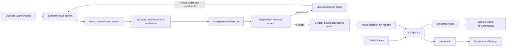
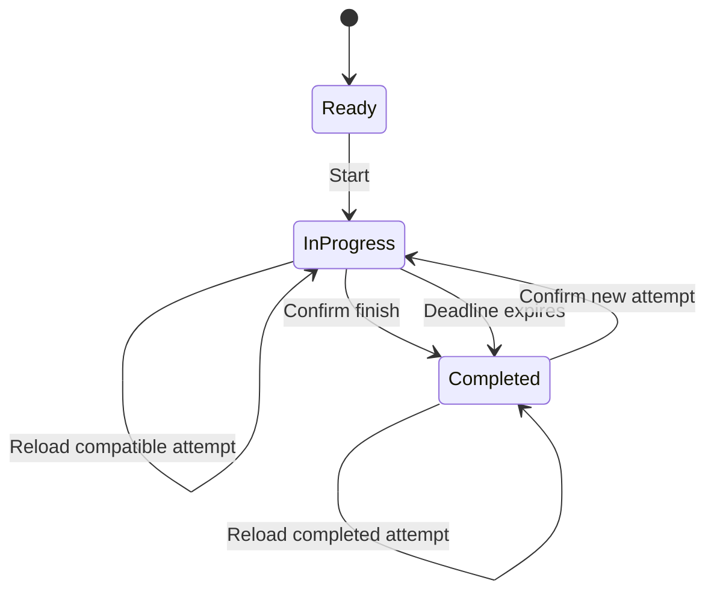

# Practice Exam Architecture

## Target Context

The browser loads a static React application from GitHub Pages. The application imports immutable TypeScript question sets, stores the current or completed attempt in browser `localStorage`, and opens cited Google Cloud documentation in external pages. There is no application server or user account. The application shell is implemented; the active registry remains empty until the first 50-question set passes [the documented activation gate](/bdr/0003-content-bound-question-activation.md).

## Module Ownership

| Module | Ownership |
|---|---|
| `src/domain/` | Owns question types, attempt state, scoring, structural validation, and persistence contracts. |
| `src/data/questionSets/sections/` | Owns complete, independently mergeable exam-guide sections before full-set assembly. |
| `src/data/questionSets/drafts.ts` | Owns partial question-set manifests used by structural and live-source verification. |
| `src/data/questionSets/candidates.ts` | Owns complete candidate assembly from registered draft identifiers. |
| `src/data/questionSets/index.ts` | Owns the active registry. Activation joins a candidate with its independent accepted review document. |
| `docs/reviews/` | Owns independently authored rejection reports and accepted semantic review records. |
| `.opencode/skills/gcp-pde-question-authoring/` | Owns the repository-specific sourcing, drafting, verification, and author-handoff procedure. |
| `.opencode/skills/gcp-pde-question-review/` | Owns final independent semantic review and content-bound acceptance records. |
| `src/components/` | Owns start, exam, navigation, submission, and result-review interfaces. |
| `src/App.tsx` | Owns screen transitions and restoration of the persisted attempt. |
| `scripts/` | Owns documentation checks, live question-source validation, and review-record generation. |
| `.github/workflows/` | Owns continuous integration, visual cleanup, and GitHub Pages deployment. |

The authoring skill produces one final-count section at a time and registers it in the partial question-set manifest. Before review, `make verify-sources` validates every registered section and fetches every unique evidence URL. `src/data/questionSets/candidates.ts` assembles candidates only from registered draft identifiers. A failed review creates an indexed, content-bound rejection report and returns the affected IDs to an independent author. After that report is added, `make verify-sources` binds its machine record to the exact registered candidate. The rejected candidate remains immutable and registered; corrections use a new candidate ID so the historical rejection remains verifiable. `src/data/questionSets/index.ts` refuses activation unless the matching `docs/reviews/<set-id>.md` acceptance record carries the exact candidate version and canonical SHA-256 content digest. The Pages workflow serves the compiled application. `App.tsx` joins the active registry, domain behavior, and screen components. Domain persistence is the only mutable storage boundary. Result links open Google Cloud source evidence outside the application.

## Attempt Data Flow

1. The candidate starts the active question set.
2. The application creates an attempt with an absolute two-hour deadline.
3. Answer, navigation, and review-flag changes replace the immutable attempt state and persist it locally.
4. Manual submission or deadline expiration creates a completed result.
5. Scoring compares answer identifier sets exactly and calculates total and section percentages.
6. Result review joins each response with choice feedback and source evidence from the immutable question set.

Every in-progress state change is saved under the versioned attempt storage key. Reload restores only state compatible with the active set; malformed or mismatched data is removed. Completed attempts remain read-only until the candidate confirms replacement.

## Deployment

Vite builds the static site with `/gcp-de-quizzes/` as its base path. After every push to `main`, `.github/workflows/pages.yml` installs the browser test runtime, runs `make test` and `make verify-sources`, uploads `dist/` only if both gates pass, and deploys the artifact to the `github-pages` environment.

## Drift Control

`make test` checks documentation structure, TypeScript, ESLint, unit and component behavior, the production build, and desktop and mobile browser flows. Question invariants are checked at section, draft-set, candidate-set, and review-record boundaries. `make verify-sources` checks draft and candidate registries plus live URLs. Deployment is checked by the Pages workflow and requires a live URL smoke test before the full issue closes.

## Related Decisions

- [Static typed application architecture](/adr/0001-static-typed-application.md)
- [Exam attempt and scoring behavior](/bdr/0001-exam-attempt-and-scoring.md)
- [Content-bound question validation and activation](/bdr/0003-content-bound-question-activation.md)
