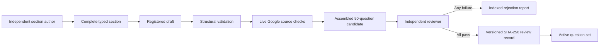

# 0003. Content-Bound Question Validation and Activation

## Context

[BDR 0002](/bdr/0002-question-validation-and-activation.md) established structural, source, and independent-review gates. It did not bind acceptance to the exact reviewed content or require complete candidates to derive from recorded section authors. A stale review could therefore accept later changes that retained identifiers and dates.

## Behavior Flow

## Textual Description

Each registered section records one author and contains its final count: 11 `design`, 12 `ingest`, 10 `store`, 8 `analyze`, or 9 `operate` questions. A draft may omit sections while work proceeds, but malformed or incomplete registered sections fail validation. Candidate registration accepts only a draft identifier and assembles questions and unique authors from all five registered sections; arbitrary `QuestionSet` objects cannot enter the candidate registry.

Every question declares an exam-guide objective, four or five choices, correct answer identifiers, feedback for each choice, source evidence, and one authoritative `verifiedOn` date. Choice feedback references supporting evidence identifiers. Structural validation rejects duplicate identifiers, invalid answer references, wrong counts, section mismatches, missing feedback or evidence, non-Google source URLs, and answer-cardinality errors.

Live verification fetches every unique draft and candidate URL, follows redirects, and requires both a successful response and a final URL on an accepted Google-owned host. The final reviewer must be absent from the candidate's assembled authors. The reviewer independently checks every source, prompt, answer, distractor, objective, term, deprecation state, and originality constraint.

Any failure produces an indexed, dated rejection report whose generated machine record is the single authoritative list of rejected question identifiers and concrete reasons. The record binds those rejections to all 50 reviewed identifiers, the candidate version, authors, source-check result, and canonical SHA-256 content digest. Verification rejects missing, duplicate, or unknown identifiers, empty reasons, and reports without an exact registered candidate. The rejected candidate remains immutable and registered; corrections use a new candidate identifier so the historical report remains verifiable. Rejected reviews cannot activate a set. Acceptance requires all 50 identifiers, no rejected questions, the canonical source-check command and successful result, the exact candidate version, and a canonical SHA-256 digest covering metadata, authors, questions, answer keys, feedback, and evidence. Any content or provenance change invalidates the old record and requires a new independent review.

## Scenarios

**Scenario 1: Validate an independently mergeable section**

- Given a partial draft with one registered exam-guide section
- When structural and source verification run
- Then the section passes only at its final count with valid mappings and reachable Google-owned evidence

**Scenario 2: Reject a candidate outside the draft path**

- Given a candidate identifier with no registered complete draft
- When candidate assembly runs
- Then registration fails before review or activation

**Scenario 3: Record rejected questions**

- Given an independent reviewer finds ambiguous or unsupported questions
- When review ends
- Then an indexed rejection report records every rejected identifier and reason in one visible, machine-validated record and no accepted activation record is created

**Scenario 4: Activate exact reviewed content**

- Given a complete assembled candidate and an independent record accepting every identifier with no rejections
- When the recorded version and SHA-256 digest match the candidate
- Then the candidate can enter the active registry

**Scenario 5: Reject content changed after review**

- Given an accepted record for one exact candidate
- When any prompt, answer, feedback, objective, evidence, author, or metadata changes
- Then activation rejects the stale record

## Test Design

| Case | Level | Input or scenario | Observable assertion | Proves |
|---|---|---|---|---|
| Section count | Unit | Registered section below its final count | Validation names the section and expected count | Partial content cannot masquerade as a complete section. |
| Section mapping | Unit | Question section differs from its module | Validation names the question and expected section | Section ownership remains deterministic. |
| Candidate provenance | Unit | Candidate ID absent from draft registry | Assembly fails | Candidates derive only from registered drafts. |
| Redirect policy | Unit | Google URL resolves to non-Google final URL | Source verification fails | Redirects cannot bypass source ownership. |
| Live source | Integration | Unique draft and candidate URLs | All responses succeed on accepted final hosts | Evidence was reachable at verification time. |
| Missing review | Unit | Assembled candidate without a review document | Activation fails | Authoring alone cannot activate content. |
| Malformed review | Unit | Review document without a valid JSON record | Activation fails | Provenance must be machine-readable. |
| Review independence | Unit | Reviewer also appears in assembled authors | Validation fails | Authors cannot accept their own work. |
| Rejected content | Unit | Review record includes rejected questions | Activation fails | Rejections cannot coexist with acceptance. |
| Rejection format | Unit | Rejection record has missing, duplicate, unknown, or unexplained IDs | Validation fails | Rejection handoffs are complete and machine-readable. |
| Rejection binding | Integration | Indexed rejection report and candidate registry | Every report matches one exact immutable candidate | Historical rejection evidence cannot detach from reviewed content. |
| Content binding | Unit | Candidate differs from recorded version or SHA-256 digest | Activation fails | Acceptance applies only to exact reviewed content. |
| Review commands | Integration | Documented acceptance and rejection record CLIs | Commands execute outside Vite | Reviewers can produce both required artifact types. |

## Related

- Supersedes: [BDR 0002](/bdr/0002-question-validation-and-activation.md)
- PRD: [/prd/0001-documentation-backed-exam-simulator.md](/prd/0001-documentation-backed-exam-simulator.md)
- ADR: [/adr/0001-static-typed-application.md](/adr/0001-static-typed-application.md)
- Issue: [/issues/0001-build-and-deploy-simulator.md](/issues/0001-build-and-deploy-simulator.md)
- Research: [/research/0001-exam-format-and-content-policy.md](/research/0001-exam-format-and-content-policy.md)
